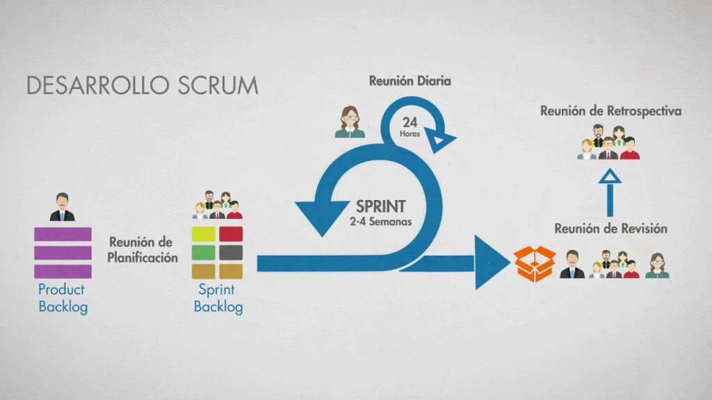
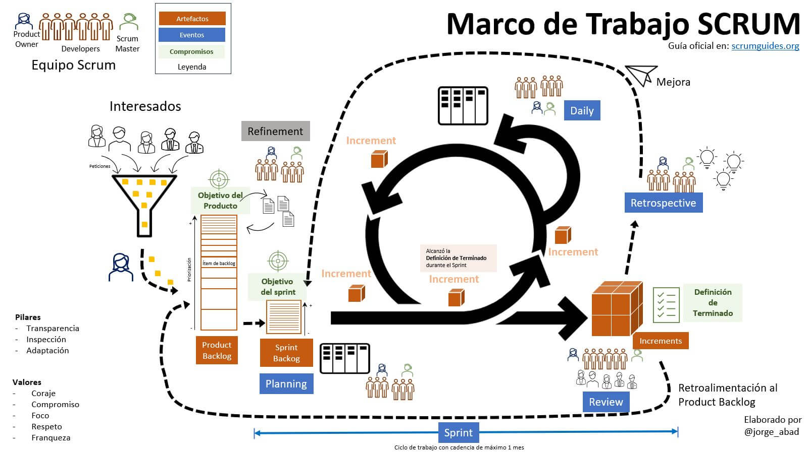

# Metodología SCRUM

La metodología scrum es una estructura de trabajo que se emplea dentro de un grupo qué atiende proyecto o tareas complejas. En otras palabras se trata de un trabajo ágil que tiene como objetivo la entrega de trabajos en un lapso de tiempo corto.

Consiste en abordar cualquier proyecto dividiéndolo en sprints o partes más pequeñas. Dentro de este entorno de trabajo hay que seguir una serie de fases para abordar cada tarea, y participan unos roles específicos que garantizan el cumplimiento de esta filosofía de trabajo.

## Fundamento

La metodología scrum está estructurada con base en la metodología ágil, teniendo los siguientes factores principales:

- Flexibilidad en la incorporación de cambios y nuevos requerimientos durante un plan o esquema de trabajo complejo.

- En la estructura de metodología scrum se toma en cuenta el factor humano como capacidad de respuesta al proyecto de trabajo.

- Se fortalece y sé contribuye a una mejor interacción o comunicación con el cliente.

- Se implementan el desarrollo interactivo como fórmula para garantizar excelentes resultados.

## Pilares

La metodología Scrum tiene tres pilares principales y son los siguientes:

### 1. Transparencia
El método scrum y su factor de transparencia permite a todos los implicados tener conocimiento de como se maneja y trabaja en el proyecto. Esto se transforme en una ventaja, ya que existirá un entendimiento colectivo del proyecto, dando al mismo tiempo una perspectiva completa del trabajo.

### 2. Inspección
Quienes componen el equipo Scrum efectúan de forma regular un examen del desarrollo del proyecto y así detectar posibles obstáculos. No se realiza una inspección diaria, ya que no es el objetivo principal. Al contrario es para tener un conocimiento de como evoluciona el trabajo y garantizar de que el equipo funciona de manera auto organizativa.

### 3. Adaptación
Cuando se requiere de un cambio, la metodología scrum y su factor de adaptación permite ajustar lo que sea necesario para cumplir mejor su objetivo de sprint. Así que el éxito estriba en que todo el equipo sea flexible y adaptable para poder realizar proyectos más complejos. Ya que por lo general proyectos de gran magnitud generan requisitos cambiantes y pocos definidos.

## Perfiles y roles del equipo

Con la metodología scrum, el equipo de trabajo orbita alrededor de un núcleo de entrega eficiente y resultados de calidad. Esto a la vez le faculta la posibilidad de cumplir los objetivos de negocio con el cliente.

Ahora para lograr todo esto se exige que los equipos scrum sean autoorganizados y multifuncionales. En otras palabras cada miembro del equipo es responsable de cumplir con las tareas determinadas y de entregarlas en el tiempo establecido.

### 1. Producto Owner

El producto owner es responsable de optimizar el valor de trabajo de todo el equipo de desarrollo. Así es, la optimización del valor del trabajo viene o está acompañada de una buena administración del product Backlog. Product owner es el único encargado de mantener constante comunicación con el cliente, lo que implica tener conocimientos profundos de negocios.

Por otra parte, en un Scrum solo existe un Product Owner, y también puede formar parte del equipo.

### 2. Scrum Master

El Scrum Master es el encargado de que se entiendan, comprendan y apliquen las técnicas de metodología scrum. Es decir, es un líder que se responsabiliza de vencer los obstáculos o problemas que presenten el equipo. Ya que, estas fortalecen y mejora las técnicas que se emplean en marketing digital.

Además, el Scrum Master también se encarga de ayudar a todo los miembros del equipo a adaptarse a la metodología ágil.

### 3. Equipo de desarrollo

En el equipo de desarrollo estan los encargados de efectuar las tareas de carácter prioritario por el Product Owner. Como se explicó anteriormente son personas con capacidad multifuncional y autoorganizada.

## Funcionamiento

La metodología SCRUM consiste en abordar cualquier proyecto dividiéndolo en sprints o partes más pequeñas. Dentro de este entorno de trabajo hay que seguir una serie de fases para abordar cada tarea, y participan unos roles específicos que garantizan el cumplimiento de esta filosofía de trabajo.

## Sprint

El Sprint es el centro o núcleo de Scrum, es aquí donde se depositan las demás etapas o hitos de todo el proceso de la metodología. Ahora todo lo que sucede en una iteración para entregar valor se encuentra dentro de un sprint, con una duración de un mes aproximadamente.

Cabe destacar, que todo dependerá del nivel de comunicación o información que mantenga el cliente con el equipo de trabajo. Los sprints que tienen una duración prolongada pierden el feedback de gran valor que se tiene con el cliente poniendo en riesgo todo el proyecto a ejecutar.

## Fases

En la metodología Scrum existen 5 Fases o hitos que forman parte de un proceso, a continuación, te explicamos cuáles son, veamos.

### 1. Sprint planning

El sprint planning es la reunión donde todo el equipo traza las tareas que se van a trabajar y cuál es el objetivo del sprint. Además, la duración de estas reuniones pueden durar hasta 8 horas para un sprints de un mes. Por otro lado, se plantean algunas preguntas que ayudan a definir los objetivos a trazar, veamos algunas.

**¿Qué se va a hacer en el sprint?**
Con base en ello, se analizan y seleccionan tareas del Product backlog.

**¿Cómo lo vamos a hacer?**
El equipo de desarrollo determina las actividades necesarias para completar cada artículo elegido del Product Backlog.

El contexto de lo que se realizará implica que todo el equipo comprenda que hay un objetivo común. Y al mismo tiempo se comprometan a cumplirlo y realicen una entrega de valor al cliente al final del sprint.

### 2. Daily meeting

Daily meeting consiste en una reunión dentro del sprint teniendo un máximo de duración de 15 minutos. Aquí participa obligatoriamente el equipo de desarrollo y el Scrum Master. Además, el product owner no necesita o no se requiere de su presencia.

Esta reunión que se efectúa de manera diaria sirve para que el equipo de desarrollo realice preguntas tales como las siguientes:

**¿Qué hice ayer?**
**¿Qué voy a hacer hoy?**
**¿Tengo algún obstáculo que necesito que me solucionen?**

Reuniones como estas son una oportunidad para poder examinar el trabajo y da entrada para adaptarse cuando se presente un cambio de tareas dentro del sprint.

### 3. Backlog refinement.
Es un repaso de las tareas y su evolución por parte del Product Owner con el fin de evaluar el tiempo y esfuerzo empleado en cada tarea y para resolver cualquier inconveniente encontrado en el camino.

### 4. Sprint review
El Sprint review del valor que vamos a entregar al cliente se realiza en esta reunión, normalmente al final de cada sprint. Habitualmente se realiza una reunión aproximadamente de 4 horas para cada sprint de un mes.

Además, es esta reunión si puede asistir el cliente, y al mismo tiempo el product owner presenta el trabajo desarrollado. También el equipo de desarrollo puede manifestar su funcionamiento o su eficiencia de trabajo.

Si durante el desarrollo de la tarea se presentaron cambios, el cliente se encarga de validar o aprobar las modificaciones realizadas. Al mismo tiempo brinda un feedback sobre las nuevas tareas que el product owner tendrá que añadir al product backlog.

### 5. Sprint retrospective
El sprint retrospective es la última reunión que se realiza en Scrum, esta tiene una duración de tres hora como máximo para un sprint mensual. En medio de esta reunión se efectúa una evaluación de como se implementó durante el último mes la metodología scrum.

Esta da la posibilidad de que el equipo que utiliza la metodología scrum se analice desde adentro y proponga mejora para el siguiente sprint.

A continuación se muestra un diagrama con las fases de SCRUM:

## Herramientas

En el mercado existe una amplia oferta de herramientas o software especialmente diseñado para gestionar proyectos bajo la metodología SCRUM.

Algunas de estas plataformas SCRUM más destacadas son Jira y Trello