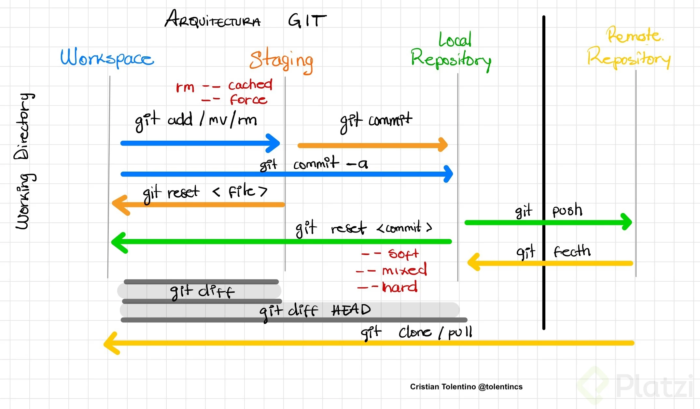
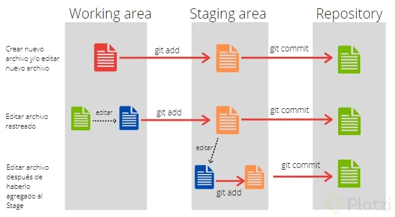
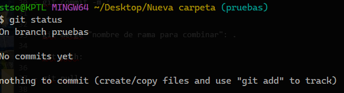
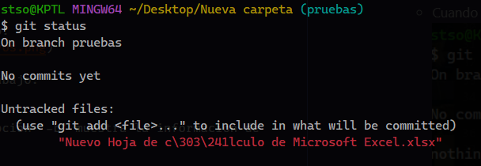
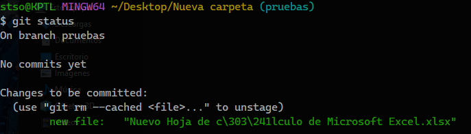
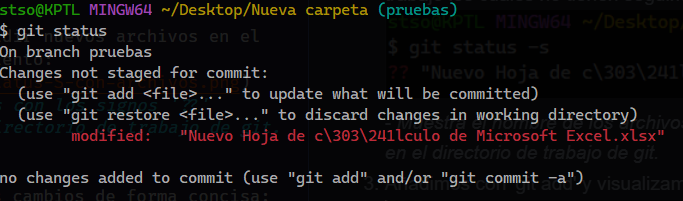
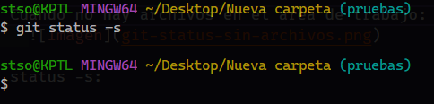
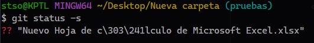
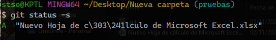
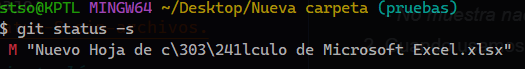

# ¿Qué es Git?
Git es un sistema de control de versiones que permite llevar un registro de todos los cambios que se realizan en un repositorio.

# Ramas
Git maneja un sistema de ramificación, cada rama se denomina como 'branch' y normalmente al iniciar con git se crea la rama 'main', anteriormente llamada 'master', y se deja como la rama principal donde se insertarán los cambios de las otras ramas y de donde se puede crear nuevas ramas pero no hacer modificaciones en esta.

# CLI
Git funciona a través de comandos que se ingresan en una 'interfaz de línea de comandos', traducido del inglés 'Command Line Interface' abreviado como 'CLI' el cual maneja el intérprete de órdenes 'Bash'.

# Ciclo de trabajo
El ciclo de trabajo de git se le demonina "working directory", directorio de trabajo en español.
En este ciclo se conocen 2 fases:  
- La primera fase se le conoce como "work area" o "workspace" que traducido es área de trabajo. Aqué se crean todos los nuevos archivos o tambien las modificaciones de los archivos existentes.
- La segunda es el "staging area" o también conocido como área de ensayo, que es donde se almacenan todos los cambios traidos del área de trabajo.

Luego de realizar todos los cambios deseados pasamos los repositorios, el primero es el repositorio local y el segundo es el repositorio remoto.
-  El repositorio local, que es donde se guarda definitivamente todos los cambios realizados en la máquina del usuario.
-  El repositorio remoto es donde se suben los archivos del repositorio local a un servicio en la nube como github, gitlab o bitbucket a través de internet.

# ¿Cómo iniciar el control de versiones?
Para iniciar el control de versiones se debe acceder a la carpeta o directorio donde se desee comenzar a utilizar este sistema y luego utilizar los comandos existentes teniendo en cuenta la funcionalidad que tiene cada uno.

# Comandos de Git
Todos los comandos de git siempre inician con 'git' para poder ejecutar las funcionalidades de este software.

- **git init**: Para iniciar o reiniciar con el control de versiones.

- **git branch** "nombre de nueva rama": Para crear una nueva rama a partir de la rama donde se ubica actualmente el usuario, junto debe ir el nombre de la nueva rama.

- **git switch** o **checkout** "nombre de rama existente": Para cambiar entre las ramas colocando el nombre de la rama a donde se desea ir.

- **git add**: Sirve para añadir un archivo nuevo o que haya sido modificado o actualizado declarando el nombre especifico del archivo o todos los archivos con la opción "--all" o con un punto "." y el contenido agregado va al "staging area" o "area de ensayo".

- **git status**: Sirve para ver el estado de la rama donde uno se ubica y puede mostrar la información de la siguiente manera:

1. Cuando no hay archivos en el area de trabajo:
        

2. Cuando usamos este comando después de añadir nuevos archivos en el area de trabajo los cuales no tienen seguimiento:
        

3. Añadimos con 'git add' y visualizamos los cambios:
        

4. Aqui visualuzamos las modificaciones:
        

- **git status -s**: El comando 'git status' con la opción '-s' muestra la informacion de forma abreviada.

1. Cuando no hay archivos en el area de trabajo:
                
        - *No muestra nada y salta a la siguiente línea.*

2. Cuando usamos este comando después de añadir nuevos archivos en el area de trabajo los cuales no tienen seguimiento:
        
        - *Muestra el nombre de los archivos con los signos '??' porque no estan registrados en el directorio de trabajo de git.*

3. Añadimos con 'git add' y visualizamos los cambios de forma concisa:
        

4. Aqui visualuzamos las modificaciones de forma concisa:
        

- **git rm**: Este comando con la opción '--cached' sirve para quitar uno o mas archivos del "staging area" y regresarlos al "workspace".

- **git restore**: Con este comando podemos reestablecer las modificaciones de un archivo especificado.

- **git commit -m**: Se utiliza después de agregar nuevos archivos o también realizar los cambios en los archivos existentes.

- **git reset**: Se utiliza para regresar un archivo del "staging area" o un  "commit" del repositorio al "workspace".

- **git merge**: Este comando sirve para fusionar la rama seleccionada después de escribir es comando con la rama en donde nos ubicamos.

- **git push**: Con este comando podemos subir nuestros cambios del repositorio local al servidor en la nube.

- **git pull**: Realiza la función inversa de "git push". Podemos bajar los archivos del servidor en la nube a la máquina del usuario.

- **git log**: Muestra el registro de los commits con información detallada del autor, fecha y hora que se han realizado.

- **git remote**: Permite crear, ver y eliminar conexiones remotas con otros repositorios. Para crear una conexión se utilizan las opciones "add origin".

> Para ver mas sobre git podemos ir la documentación oficial en : [git-scm.com](https://git-scm.com)